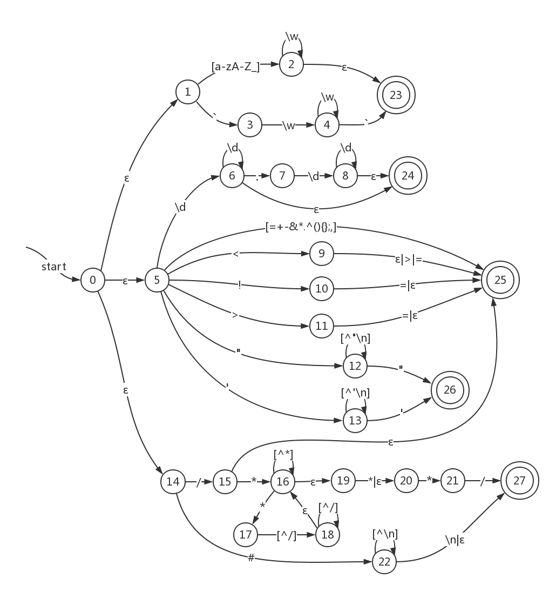
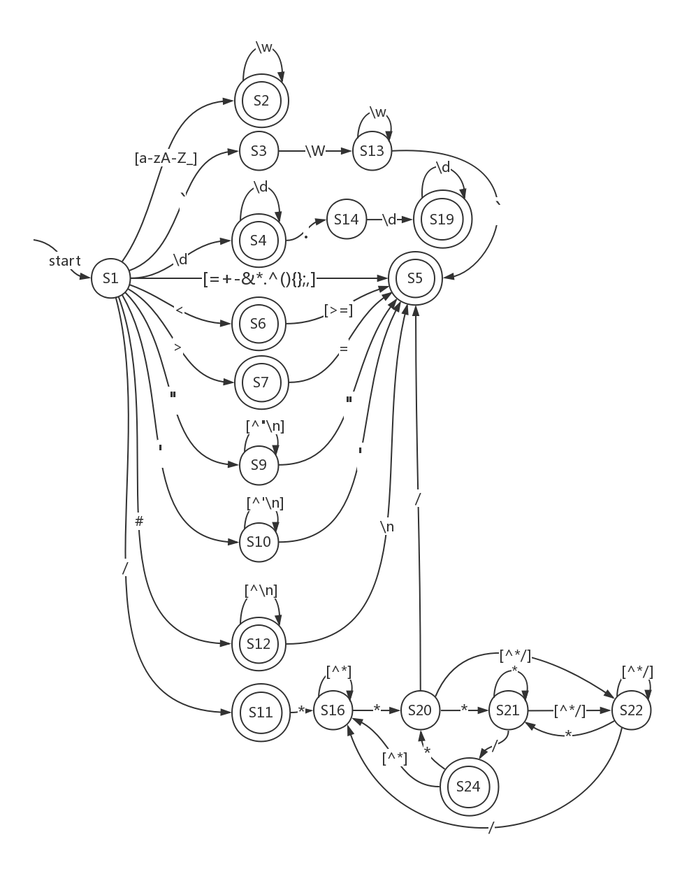

# Compiling Techniques Lab

## Motivation/Aim

​	编写、调试⼀个简易SQL词法分析程序，对基础SQL语句进⾏词法分析，从⽽更好理解词法分析原理；深⼊体会正则表达式转化为NFA、NFA转化为DFA、DFA优化并转化为后续代码的过程。 

## Content description

​	程序⽤Java编写。程序读取⼀个⽂本⽂件，并对其中的内容进⾏词法分析，此程序基本实现了对SQL语言的词法识别，可识别并去除注释，识别字符串、数字、保留字（或标识符）、操作符和分隔符，并输出格式为<识别的单词符号, 种别码>的Token序列；对不符合可识别格式的字符进⾏报错，并指明所在⾏数。

## Ideas/Methods

  1. 针对要识别的单词符号写出正则表达式 
  2. 构造出每个正则表达式对应的NFA，并合并为一个NFA
  3. 将NFA化简为最小DFA 
  4. 基于最小DFA编写代码 
  5. 先读取⼀个输⼊字符，判断其可能的类别，再读取下⼀个继续判断，若已经识别出则
    添加到输出token序列，多读的需要退回，否则继续依次读取下⼀个字符，直到结束符为⽌ 

## Assumptions

  1. 保留字的识别优先级⾼于标识符
  2. 输入文件的编码为UTF-8
  3. 字符全集为`\t`、`\n`以及ASCII码中的所有可打印字符，输⼊⽂件内容也仅由这些字符组成
  4. 未被反引号`` ` ``括起的标识符不以数字开头

## Related FA descriptions

### 1. RE（按识别优先级从高到低）

#### 1) 注释

​	`com -> #[^\n]*(\n|$)|/\*([^\*]|\*[^/]+)*\*{1,2}/`

#### 2) 字符串

​	`str -> "[^"\n]*"|'[^'\n]*'`

#### 3) 数字

​	`num -> \d+(\.\d+)?`

#### 4) 保留字和标识符：

​	``word -> [a-zA-Z_]\w*|`\w+` ``

#### 5) 操作符

​	`op -> !=|<>|<=|>=|[<>/!=+-&*.^]`

#### 6) 分隔符

​	`sep -> [(){};,]`


### 2. NFA




### 3. Dtran table

| NFA state           | DFA state | change                                                       |
| ------------------- | --------- | ------------------------------------------------------------ |
| {0,1,5,14}          | S1        | [a-zA-Z_] → S2<br>` → S3<br>\d → S4<br>[=+-&*.^(){};,] → S5<br>< → S6<br>! → S7<br>> → S8<br>" → S9<br>' → S10<br>/ → S11<br># → S12 |
| {2,23}              | S2        | \w → S2                                                      |
| {3}                 | S3        | \w → S13                                                     |
| {6,24}              | S4        | \d → S4<br>. → S14                                           |
| {25}                | S5        | ∅                                                            |
| {9,25}              | S6        | [>=] → S5                                                    |
| {10,25}             | S7        | = → S5                                                       |
| {11,25}             | S8        | = → S5                                                       |
| {12}                | S9        | [^"\n] → S9<br>" → S15                                       |
| {13}                | S10       | [^'\n] → S10<br>' → S15                                      |
| {15,25}             | S11       | * → S16                                                      |
| {22,27}             | S12       | [^\n] → S12<br>\n → S17                                      |
| {4}                 | S13       | \w → S13<br>` → S18                                          |
| {7}                 | S14       | \d → S19                                                     |
| {26}                | S15       | ∅                                                            |
| {16,19,20}          | S16       | * → S20<br>\[^*] → S16                                       |
| {27}                | S17       | ∅                                                            |
| {23}                | S18       | ∅                                                            |
| {8,24}              | S19       | \d → S19                                                     |
| {17,20,21}          | S20       | * → S21<br>/ → S17<br>\[^*/] → S22                           |
| {16,18,19,20,21}    | S21       | * → S23<br>/ → S24<br>\[^*/] → S22                           |
| {16,18,19,20}       | S22       | * → S23<br>/ → S16<br>\[^*/] → S22                           |
| {16,17,18,19,20,21} | S23       | * → S23<br>/ → S24<br>\[^*/] → S22                           |
| {16,19,20,27}       | S24       | * → S20<br>\[^*] → S16                                       |


### 4. DFA with minimum states



## Description of important Data Structures

### DFA

```java
public class DFA implements Serializable {
	private String startState;  // 初始状态
	private String state;   // 当前状态，空串""代表不存在的转换到达的不存在的状态
	private Map<String, Map<String, String>> table; // 转换表：Map<current_state, Map<input_char, next_state>>
	private Set<String> endStates;  // 终态集合
}
```

​	有限自动状态机类，可以接受输入尝试进行转换，判断当前状态是否为终态。对于不合法的串不会存在对应转换（自动机状态不变，返回特殊提示）。

### Token

```java
public class Token {
	TokenType type; // 单词类型，如保留字、数字
	String value;   // 单词的值，如"select"、"123"
}
```

​	单词类，即词法分析出的单词。

​	另：单词类型包括注释（COMMENT）和错误（ERROR），这两类“单词”留待词法分析结束后删去或由语法分析器处理。

## Description of core Algorithms

1. 词法分析器（LexicalAnalyzer类）从头扫描输入流，逐一输入有限状态机；
2. DFA类提示不存在的转换后，检查其是否处于终态，是则匹配到合法串，生成Token，否则生成错误Token（错误串）或直接跳过（空白字符）；
3. 重置DFA，继续输入直至结束。

## Use cases on running

​	参见resources文件夹中的input.txt

## Problems occurred and related solutions

1. 识别过程中的空白字符和错误串处理问题：当前匹配串为空串时直接跳过，否则用其生成错误（ERROR）类型的Token，加入返回Token序列；之后从当前字符开始新的匹配。
2. 字符全集较大（共97个字符）导致的手写DFA困难：以``[abc]→state``的形式简写转换，使用`\w`、`\d`等标记，写程序处理成真正的DFA转换表。详见DFALoader类和dfa_table.txt。

## Your feelings and comments

​	计算机届的前辈们为了通用性和执行效率做出了太多努力；我们一直站在巨人的肩膀上。